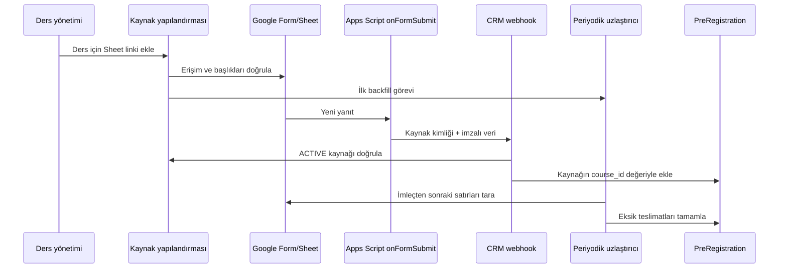

# Ders Bazlı Google Forms Canlı Entegrasyonu

Bu tasarım sabit bir form listesine dayanmaz. Her `course` kaydına ayrı bir Google Forms yanıt Sheet'i bağlanır; kaynaktan gelen bütün `pre_registration` kayıtları otomatik ve değiştirilemez biçimde ilgili derse atanır. Herhangi bir Google hesabı veya harici sistem ayarı değiştirilmemiştir.

## Başlangıç kaynaklarının güvenli taşınması

İlk analizde kullanılan gerçek çalışma kitabı URL ve GID değerleri kişisel veriye erişimi kolaylaştırmamak için repository ve demo seed içinden çıkarılmıştır. Sistem sabit bir kaynağa özel kodlanmaz; production kaynağı ADMIN tarafından arayüzden eklenir.

Kişisel veri içeren kaynak için varsayılan yol `WEBHOOK_ONLY` olmalıdır. Böylece Sheet public/published yapılmaz; Form'a bağlı Apps Script kararlı `responseId` ile HMAC imzalı payload gönderir. Public CSV modu yalnız kurumun veri politikası açıkça izin veriyorsa seçilir.

## Veri modeli ve değişmez kurallar

```text
Course 1 ── 0..N ExternalRegistrationSource ── 0..N PreRegistration
```

- Bir kaynak tam olarak bir derse bağlıdır.
- Bir ders için geçmiş kaynaklar tutulabilir, ancak aynı anda en fazla bir kaynak `ACTIVE` olabilir.
- `UNIQUE (provider, spreadsheet_id, sheet_gid)` aynı yanıt sekmesinin iki derse bağlanmasını engeller.
- Ön kaydın `course_id` değeri istek gövdesinden veya bir hücreden alınmaz; backend bunu `external_registration_source.course_id` ilişkisinden yazar.
- Link değişse bile geçmiş ön kayıtların kaynak ve ders ilişkisi değişmez.

## Ders yönetiminden kaynak ekleme

1. Yetkili kullanıcı ders ayrıntısındaki “Google Forms kayıt kaynağı” alanına Sheet bağlantısını yapıştırır.
2. Backend URL'den `spreadsheet_id` ve `gid` değerini çıkarır, bağlantıyı kanonikleştirir ve salt okunur erişimi sınar.
3. GID yoksa bulunan sekmeler kullanıcıya seçtirilir; sekme adı yalnız gösterim, GID kalıcı kimliktir.
4. Başlıklar okunur ve alan eşlemesi önizlenir.
5. Aynı `spreadsheet_id + gid` başka derse bağlıysa kayıt engellenir.
6. Kaynak önce `PAUSED` oluşturulur ve kuru tarama yapılır.
7. “Kaydet ve ilk senkronu başlat” işlemi geçmiş kayıtları aktarır; başarıdan sonra kaynak `ACTIVE` olur.

Kaynak; `course_id`, `provider`, `spreadsheet_id`, `spreadsheet_url`, `sheet_gid`, `sheet_name`, `status`, `secret_reference`, `sync_cursor`, `last_synced_row`, `last_sync_at`, `last_webhook_at`, `last_success_at`, `last_error_code` ve `consecutive_failures` alanlarıyla izlenir.

## Kaynak alan eşlemesi

| Sheet başlığı | CRM alanı | Kural |
|---|---|---|
| `Zaman damgası` | `source_submitted_at` | Ayrıştırılamazsa uyarı |
| `Column 12` | `source_course_label` | Yalnız tanısal; ders seçmez |
| `Adınız ve soyadınız` | `full_name` | Kesin kayıtta ad/soyad doğrulanır |
| `Telefon numaranız` | `phone_raw`, `phone_normalized` | Ham değer korunur |
| `Doğum tarihiniz` | `birth_date` | Geçersiz biçim uyarı üretir |
| `Katılım sağlayacağınız ilçe` | `district` | Metin/kategori |
| Önceki katılım sorusu | `previous_participant` | Evet/hayır |
| Önceki eğitim sorusu | `previous_course` | Koşullu metin |
| `Medeni haliniz` | `marital_status` | Metin/kategori |
| `Kaç çocuğunuz var?` | `children_count` | Negatif olmayan tam sayı |
| `Mezuniyet durumunuz` | `education_level` | Metin/kategori |
| Programdan haberdar olma sorusu | `discovery_channel` | Başlık varyasyonları aynı alana gider |

Sütun sırasına güvenilmez. Eksik veya eski biçimli satırlar atılmaz; `validation_errors` ile operatör kuyruğuna alınır.

## Canlı webhook ve reconciliation



Canlı yol düşük gecikme sağlar. Periyodik polling/reconciliation; webhook kesintisi, Apps Script kotası veya ağ hatasında veri kaybını önler. İki yol aynı kaynak kayıt kimliğini kullanır.

## Webhook sözleşmesi

```text
POST /api/integrations/google-forms/sources/{externalSourceId}/responses
```

Üst bilgiler:

- `X-RAHMET-Timestamp`: Unix zaman damgası.
- `X-RAHMET-Signature`: `HMAC-SHA256(sourceSecret, timestamp + "." + rawBody)`.

Gövde `sourceRecordId`, `sourceSubmittedAt`, `sourceRowNumber` ve standartlaştırılmış `fields` nesnesini içerir. `courseId` özellikle gönderilmez. Backend URL'deki kaynağı yükler, imzayı kaynağın `secret_reference` değeriyle doğrular ve kaynağın dersini kullanır.

- `201`: oluşturuldu.
- `200`: daha önce işlendi; başarı sayılır.
- `409`: kaynak pasif veya yapılandırması çelişkili.
- `400/422`: kalıcı veri/şema hatası.
- `401/403`: imza/yetki hatası.
- `429/5xx`: geçici hata; tekrar denenir.

## Idempotency

Form yanıt kimliği varsa `source_record_id` olarak kullanılır. Yalnız Sheet olayı varsa yedek kimlik:

```text
Öncelik Google Forms `responseId` değeridir. Bu değer yoksa form zamanı ve normalize edilmiş sabit alanlardan `stable-v2:{sha256}` kimliği üretilir. Satır numarası yalnız eski kayıtların ilk geçişinde eşleme amacıyla kullanılır; yeni kayıtların kalıcı kimliği değildir.
```

Hem `pre_registration` hem `integration_event` için `UNIQUE (external_source_id, source_record_id)` zorunludur. Zaman damgası, telefon veya `Column 12` kimlik değildir.

## İlk senkron ve backfill

1. `PAUSED` kaynakta erişim, başlıklar ve satır sayıları salt okunur doğrulanır.
2. Eksik alan, hatalı tarih ve yinelenen kimlikler kişisel değer loglamadan raporlanır.
3. Her satır normal webhook işleme hattına verilir.
4. Başarılı bölümlerden sonra `sync_cursor` ve `last_synced_row` ilerletilir.
5. İşlem kesilirse aynı bölüm güvenle tekrar çalışır.
6. Kaynak satır sayısı başarılı, uyarılı ve başarısız olay toplamıyla uzlaştırılır.
7. Tamamlanınca `last_success_at` yazılır ve kaynak `ACTIVE` olur.

## Periyodik uzlaştırma

- Aktif kaynaklar son imleçten itibaren periyodik taranır; yakın geçmiş penceresi de tekrar kontrol edilir.
- Kaynak başına kilit, iki taramanın eşzamanlı çalışmasını engeller.
- Webhook çalışıyor fakat reconciliation gecikiyorsa scheduler; polling çalışıyor fakat webhook gelmiyorsa Apps Script sağlık uyarısı üretilir.
- Günlük kontrollü full scan ve artımlı taramadaki geriye bakış penceresi, satır ekleme/taşıma ile geç gelen düzeltmeleri yakalar.

## Link değiştirme ve pasifleştirme

- `PAUSED` kaynak yeni webhook ve polling işlemez; geçmiş kayıtlar korunur. Devam ettirmede kısa reconciliation yapılır.
- Link değişiminde mevcut kaynak yerinde dönüştürülmez. Yeni kaynak doğrulanır; tek işlem içinde eski kaynak `ARCHIVED`, yeni kaynak `ACTIVE` yapılır.
- Eski kaynaktan geç gelen teslimatlar reddedilir veya yalnız audit kaydı olur.
- Kaynak silinmez; geçmiş zincirinin korunması için arşivlenir.

## Hata ve sağlık

- Ders ve kaynak bazında durum, son başarı, son webhook, son reconciliation, imleç, son hata ve ardışık hata sayısı gösterilir.
- `429/5xx` hataları üst sınırı olan üstel gecikmeyle tekrar denenir.
- `400/422` olayları manuel düzeltme kuyruğuna; azami denemeyi aşan olaylar `DEAD_LETTER` durumuna gider.
- Erişim kaldırılır, sekme silinir veya başlıklar değişirse kaynak `ERROR` olur; geçmiş kayıtlar korunur.
- Loglarda ad, telefon ve ham istek gövdesi tutulmaz.

## Güvenlik

- Yalnız HTTPS ve kaynak bazlı HMAC kullanılır.
- Sırlar düz metin kod/veritabanı alanında değil güvenli depoda tutulur; tabloda yalnız `secret_reference` bulunur.
- Yalnız `ACTIVE` kaynak teslimat kabul eder.
- Kaynak ekleme, değiştirme, aktif etme ve hata kuyruğu yönetimi `ADMIN` yetkisi ve audit kaydı gerektirir.

## Kalan teknik bağımlılık

Backend, HMAC webhook, bounded retry/dead-letter ve reconciliation akışları uygulanmıştır. Kalan dış ortam bağımlılıkları HTTPS alan adı, PostgreSQL kimlikleri, güvenli secret store, cron scheduler ve gerçek Google Form üzerinde kontrollü kabul testidir. Kişisel verili Sheet production'da public yapılmamalı; özel Form için `WEBHOOK_ONLY` + Apps Script push kullanılmalıdır.
