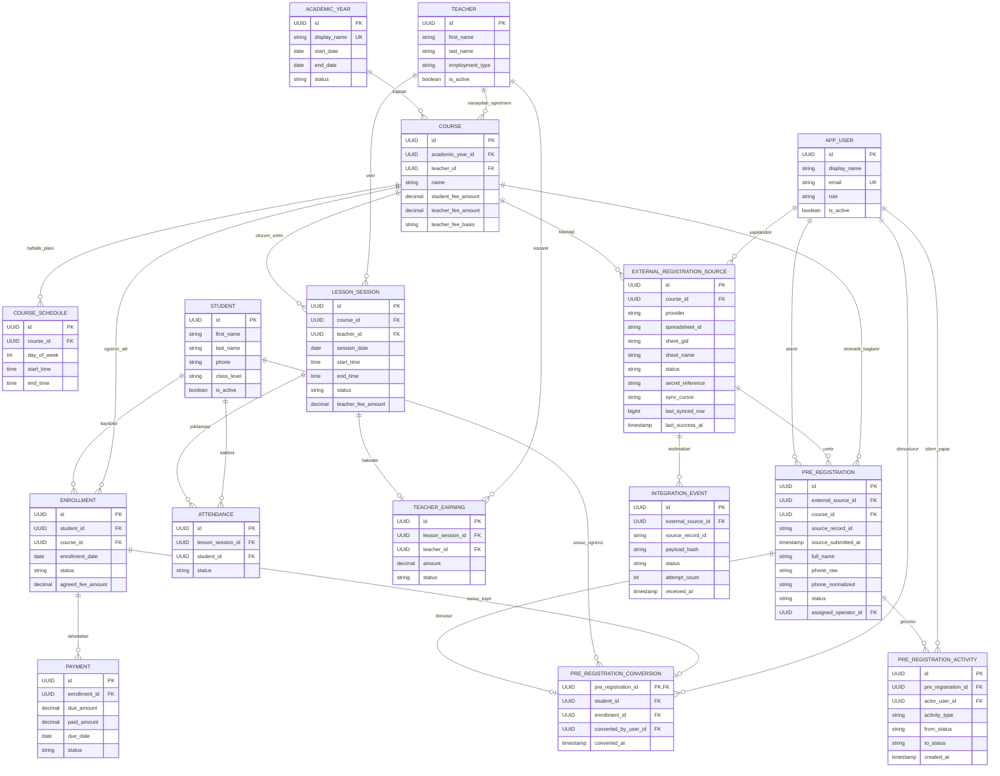

# Akademi / Kurs Yönetimi Veritabanı Şeması

Bu belge, `first-note` içindeki ilk fikirleri teknoloji-bağımsız bir ilişkisel veri modeline dönüştürür. Veri tipi adları geneldir; seçilecek veritabanına göre (`UUID`, `DECIMAL`, `TIMESTAMP` vb.) küçük uyarlamalar yapılabilir.

## Genel tercihler

- Tüm kimlikler `UUID` olarak önerilir.
- Para alanları kayan noktalı tip yerine `DECIMAL(12,2)` kullanır.
- Belgedeki bütün tutar alanları doğrudan Türk lirası (TL) cinsindendir; sistem başka bir para birimini desteklemez.
- Tarih-saat değerleri uygulamanın belirlediği tek bir saat diliminde saklanmalıdır.
- Fiziksel silme yerine ana kayıtlarda `is_active` veya durum alanı tercih edilir.
- Her tabloda isteğe bağlı olarak `created_at TIMESTAMP NOT NULL` ve `updated_at TIMESTAMP NOT NULL` denetim alanları bulunabilir.

## Tablolar

### `academic_year` — Akademik dönem

| Alan | Tip | Zorunlu | Anahtar / kısıt | Açıklama |
|---|---|---:|---|---|
| `id` | UUID | Evet | PK | Akademik dönem kimliği |
| `display_name` | VARCHAR(100) | Evet | UNIQUE | Örn. `2026-2027` |
| `start_date` | DATE | Evet |  | Başlangıç tarihi |
| `end_date` | DATE | Evet | CHECK `end_date >= start_date` | Bitiş tarihi |
| `status` | VARCHAR(20) | Evet | CHECK: `PLANNED`, `ACTIVE`, `CLOSED` | Dönem durumu |

### `student` — Öğrenci

| Alan | Tip | Zorunlu | Anahtar / kısıt | Açıklama |
|---|---|---:|---|---|
| `id` | UUID | Evet | PK | Öğrenci kimliği |
| `first_name` | VARCHAR(100) | Evet |  | Ad |
| `last_name` | VARCHAR(100) | Evet |  | Soyad |
| `phone` | VARCHAR(30) | Hayır |  | Telefon; ülke koduyla normalize edilmesi önerilir |
| `birth_date` | DATE | Hayır |  | Doğum tarihi |
| `district` | VARCHAR(100) | Hayır |  | Yaşadığı/katılım sağlayacağı ilçe |
| `address` | TEXT | Hayır |  | Adres |
| `class_level` | VARCHAR(50) | Hayır |  | Sınıf/seviye; serbest metinle başlanabilir |
| `is_active` | BOOLEAN | Evet | DEFAULT `TRUE` | Aktif öğrenci mi? |

### `teacher` — Öğretmen

| Alan | Tip | Zorunlu | Anahtar / kısıt | Açıklama |
|---|---|---:|---|---|
| `id` | UUID | Evet | PK | Öğretmen kimliği |
| `first_name` | VARCHAR(100) | Evet |  | Ad |
| `last_name` | VARCHAR(100) | Evet |  | Soyad |
| `phone` | VARCHAR(30) | Hayır |  | Telefon |
| `employment_type` | VARCHAR(20) | Evet | CHECK: `INTERNAL`, `EXTERNAL` | Kurum içi / dışı ayrımı |
| `is_active` | BOOLEAN | Evet | DEFAULT `TRUE` | Aktif öğretmen mi? |

### `course` — Ders/kurs

| Alan | Tip | Zorunlu | Anahtar / kısıt | Açıklama |
|---|---|---:|---|---|
| `id` | UUID | Evet | PK | Ders kimliği |
| `academic_year_id` | UUID | Evet | FK → `academic_year.id` | Ait olduğu akademik dönem |
| `teacher_id` | UUID | Evet | FK → `teacher.id` | Varsayılan öğretmen |
| `name` | VARCHAR(150) | Evet |  | Ders adı |
| `student_fee_amount` | DECIMAL(12,2) | Evet | CHECK `>= 0` | Öğrenciye uygulanacak varsayılan ücret |
| `teacher_fee_amount` | DECIMAL(12,2) | Evet | CHECK `>= 0` | Varsayılan öğretmen ücreti |
| `teacher_fee_basis` | VARCHAR(20) | Evet | CHECK: `PER_SESSION`, `PER_STUDENT`, `MONTHLY` | Öğretmen ücretinin hesap temeli |
| `is_active` | BOOLEAN | Evet | DEFAULT `TRUE` | Ders aktif mi? |

Önerilen benzersizlik: Aynı akademik yılda aynı ada sahip derslerin istenmemesi halinde `UNIQUE (academic_year_id, name)`.

### `course_schedule` — Haftalık ders planı

`daysOfWeek` değerini tek bir metin/JSON alanında tutmak yerine sorgulanabilir satırlara ayırır.

| Alan | Tip | Zorunlu | Anahtar / kısıt | Açıklama |
|---|---|---:|---|---|
| `id` | UUID | Evet | PK | Plan satırı kimliği |
| `course_id` | UUID | Evet | FK → `course.id` | Ders |
| `day_of_week` | SMALLINT | Evet | CHECK `1..7` | ISO: Pazartesi=1, Pazar=7 |
| `start_time` | TIME | Evet |  | Başlangıç saati |
| `end_time` | TIME | Evet | CHECK `end_time > start_time` | Bitiş saati |

Önerilen benzersizlik: `UNIQUE (course_id, day_of_week, start_time)`.

### `enrollment` — Öğrencinin derse kaydı

| Alan | Tip | Zorunlu | Anahtar / kısıt | Açıklama |
|---|---|---:|---|---|
| `id` | UUID | Evet | PK | Kayıt kimliği |
| `student_id` | UUID | Evet | FK → `student.id` | Öğrenci |
| `course_id` | UUID | Evet | FK → `course.id` | Ders |
| `enrollment_date` | DATE | Evet |  | Kayıt tarihi |
| `status` | VARCHAR(20) | Evet | CHECK: `ACTIVE`, `COMPLETED`, `CANCELLED` | Kayıt durumu |
| `agreed_fee_amount` | DECIMAL(12,2) | Evet | CHECK `>= 0` | Öğrenciye özel anlaşılmış ücretin anlık görüntüsü |

Zorunlu benzersizlik: `UNIQUE (student_id, course_id)`. Aynı öğrenci aynı dersi sonraki akademik yılda tekrar alabilir; çünkü o ders yeni akademik yıl için ayrı bir `course` kaydıdır.

### `lesson_session` — Gerçekleşen/planlanan ders oturumu

| Alan | Tip | Zorunlu | Anahtar / kısıt | Açıklama |
|---|---|---:|---|---|
| `id` | UUID | Evet | PK | Oturum kimliği |
| `course_id` | UUID | Evet | FK → `course.id` | Ders |
| `teacher_id` | UUID | Evet | FK → `teacher.id` | Bu oturumu veren öğretmen |
| `session_date` | DATE | Evet |  | Ders tarihi |
| `start_time` | TIME | Evet |  | Başlangıç saati |
| `end_time` | TIME | Evet | CHECK `end_time > start_time` | Bitiş saati |
| `status` | VARCHAR(20) | Evet | CHECK: `PLANNED`, `COMPLETED`, `CANCELLED` | Oturum durumu |
| `teacher_fee_amount` | DECIMAL(12,2) | Evet | CHECK `>= 0` | Bu oturum için ücretin anlık görüntüsü |

Önerilen benzersizlik: `UNIQUE (course_id, session_date, start_time)`.

### `attendance` — Öğrenci yoklaması

| Alan | Tip | Zorunlu | Anahtar / kısıt | Açıklama |
|---|---|---:|---|---|
| `id` | UUID | Evet | PK | Yoklama kimliği |
| `lesson_session_id` | UUID | Evet | FK → `lesson_session.id` | Belirli ders oturumu |
| `student_id` | UUID | Evet | FK → `student.id` | Öğrenci |
| `status` | VARCHAR(20) | Evet | CHECK: `PRESENT`, `ABSENT`, `EXCUSED` | Katılım durumu |
| `note` | VARCHAR(500) | Hayır |  | Açıklama/mazeret notu |

Zorunlu benzersizlik: `UNIQUE (lesson_session_id, student_id)`. Öğrencinin ilgili oturumun dersine aktif kaydı bulunması uygulama veya veritabanı tetikleyicisiyle doğrulanmalıdır.

### `payment` — Öğrenciden tahsilat

Bu tablo yalnızca öğrenci borcu/tahsilatı içindir; öğretmen hakedişi burada tutulmaz.

| Alan | Tip | Zorunlu | Anahtar / kısıt | Açıklama |
|---|---|---:|---|---|
| `id` | UUID | Evet | PK | Ödeme kaydı kimliği |
| `enrollment_id` | UUID | Evet | FK → `enrollment.id` | Ödemenin ait olduğu öğrenci-ders kaydı |
| `due_amount` | DECIMAL(12,2) | Evet | CHECK `> 0` | Beklenen tutar |
| `paid_amount` | DECIMAL(12,2) | Evet | CHECK `0 <= paid_amount <= due_amount` | Tahsil edilen tutar |
| `due_date` | DATE | Evet |  | Son ödeme tarihi |
| `paid_at` | TIMESTAMP | Hayır |  | Tahsilat zamanı |
| `status` | VARCHAR(20) | Evet | CHECK: `PENDING`, `PARTIAL`, `PAID`, `CANCELLED` | Tahsilat durumu |
| `payment_method` | VARCHAR(20) | Hayır | CHECK: `CASH`, `CARD`, `TRANSFER`, `OTHER` | Yalnız ödeme varsa doldurulur |
| `reference_no` | VARCHAR(100) | Hayır |  | Banka/POS/makbuz referansı |

Durum tutarlılığı: `PENDING` için ödenen tutar `0`, `PARTIAL` için `0 < paid_amount < due_amount`, `PAID` için iki tutar eşit olmalıdır. Bir kayıt için birden fazla taksit oluşturulabilir.

### `teacher_earning` — Öğretmen hakedişi

Öğrenci tahsilatından bağımsızdır. Böylece öğrencinin ödeme yapıp yapmaması öğretmenin oluşmuş hakedişini değiştirmez.

| Alan | Tip | Zorunlu | Anahtar / kısıt | Açıklama |
|---|---|---:|---|---|
| `id` | UUID | Evet | PK | Hakediş kimliği |
| `lesson_session_id` | UUID | Evet | FK → `lesson_session.id` | Hakedişi doğuran oturum |
| `teacher_id` | UUID | Evet | FK → `teacher.id` | Hak sahibi öğretmen |
| `amount` | DECIMAL(12,2) | Evet | CHECK `>= 0` | Hakediş tutarı |
| `status` | VARCHAR(20) | Evet | CHECK: `ACCRUED`, `APPROVED`, `PAID`, `CANCELLED` | Hakediş/ödeme durumu |
| `paid_at` | TIMESTAMP | Hayır |  | Öğretmene ödeme zamanı |
| `reference_no` | VARCHAR(100) | Hayır |  | Ödeme referansı |

Başlangıç modeli için `UNIQUE (lesson_session_id, teacher_id)` önerilir. `PER_STUDENT` veya `MONTHLY` ücret hesapları ileride daha ayrıntılı bordro ihtiyacı doğurursa hakedişin kaynak türü ayrıca modellenebilir.

### `app_user` — CRM operatörü

| Alan | Tip | Zorunlu | Anahtar / kısıt | Açıklama |
|---|---|---:|---|---|
| `id` | UUID | Evet | PK | Kullanıcı kimliği |
| `display_name` | VARCHAR(150) | Evet |  | Ekranda gösterilecek ad |
| `email` | VARCHAR(254) | Evet | UNIQUE | Oturum açma/iletişim adresi |
| `role` | VARCHAR(20) | Evet | CHECK: `ADMIN`, `OPERATOR`, `VIEWER` | Yetki rolü |
| `is_active` | BOOLEAN | Evet | DEFAULT `TRUE` | Kullanıcı aktif mi? |

Bu tablo ön kayıt ataması ve işlem geçmişi için gereken en küçük kullanıcı referansıdır; kimlik doğrulamanın nasıl yapılacağını dayatmaz.

### `external_registration_source` — Derse bağlı Google Forms yanıt kaynağı

Her dersin Google Forms yanıt Sheet'i bu tabloda yapılandırılır. Kaynak bağlantısı doğrudan `course` kaydına bağlıdır; gelen ön kayıt hangi derse ait olduğunu form alanından değil bu ilişkiden alır.

| Alan | Tip | Zorunlu | Anahtar / kısıt | Açıklama |
|---|---|---:|---|---|
| `id` | UUID | Evet | PK | Harici kayıt kaynağı kimliği |
| `course_id` | UUID | Evet | FK → `course.id` | Bu kaynağın ön kayıt üreteceği tek ders |
| `provider` | VARCHAR(30) | Evet | CHECK: `GOOGLE_FORMS_SHEET` | Kaynak sağlayıcı |
| `spreadsheet_id` | VARCHAR(150) | Evet |  | Google Sheet bağlantısından çıkarılan çalışma kitabı kimliği |
| `spreadsheet_url` | VARCHAR(500) | Evet |  | Ders yönetim ekranında girilen, kanonikleştirilmiş bağlantı |
| `sheet_gid` | VARCHAR(50) | Evet |  | Yanıt sekmesinin kalıcı GID değeri |
| `sheet_name` | VARCHAR(150) | Hayır |  | Kullanıcıya gösterilecek sekme adı; kimlik olarak kullanılmaz |
| `status` | VARCHAR(20) | Evet | CHECK: `ACTIVE`, `PAUSED`, `ERROR`, `ARCHIVED` | Kaynağın çalışma durumu |
| `secret_reference` | VARCHAR(200) | Hayır |  | Webhook sırrının kendisi değil, güvenli yapılandırmadaki referansı |
| `sync_cursor` | VARCHAR(300) | Hayır |  | Sağlayıcıya özgü son başarılı tarama imleci |
| `last_synced_row` | BIGINT | Hayır | CHECK `>= 1` | Satır tabanlı uzlaştırmada son işlenen kaynak satırı |
| `last_sync_at` | TIMESTAMP | Hayır |  | Son uzlaştırma denemesi |
| `last_webhook_at` | TIMESTAMP | Hayır |  | Son canlı webhook teslimatı |
| `last_success_at` | TIMESTAMP | Hayır |  | Son başarılı webhook veya uzlaştırma |
| `last_error_code` | VARCHAR(100) | Hayır |  | Kişisel veri içermeyen son hata kodu |
| `consecutive_failures` | SMALLINT | Evet | DEFAULT `0`, CHECK `>= 0` | Ardışık hata sayısı |
| `created_by_user_id` | UUID | Evet | FK → `app_user.id` | Bağlantıyı tanımlayan kullanıcı |
| `created_at` | TIMESTAMP | Evet |  | Oluşturulma zamanı |
| `updated_at` | TIMESTAMP | Evet |  | Son yapılandırma değişikliği |

Zorunlu benzersizlik: `UNIQUE (provider, spreadsheet_id, sheet_gid)`. Böylece aynı yanıt sekmesi yanlışlıkla iki farklı derse bağlanamaz. Ayrıca bir ders için aynı anda en fazla bir `ACTIVE` kaynak bulunmalıdır; bunu destekleyen veritabanlarında `course_id WHERE status = 'ACTIVE'` koşullu benzersiz indeksi, diğerlerinde aynı sonucu veren işlemsel uygulama kuralı kullanılmalıdır. Geçmiş kaynakları koruyabilmek için bağlantı değişiminde eski satır `ARCHIVED` yapılır.

`UNIQUE (id, course_id)` anahtarı da tanımlanmalıdır; `pre_registration` üzerindeki bileşik yabancı anahtar kaynağın ve dersin eşleşmesini bununla doğrular.

### `pre_registration` — Google Forms ön kaydı

Form yanıtları önce bu ayrı çalışma kuyruğuna alınır; operatör onayı olmadan `student` oluşturulmaz.

| Alan | Tip | Zorunlu | Anahtar / kısıt | Açıklama |
|---|---|---:|---|---|
| `id` | UUID | Evet | PK | Ön kayıt kimliği |
| `external_source_id` | UUID | Evet | FK → `external_registration_source.id` | Yanıtı üreten yapılandırılmış Sheet kaynağı |
| `course_id` | UUID | Evet | FK → `course.id` | Kaynaktan otomatik belirlenen ders; kullanıcı girdisinden alınmaz |
| `source_record_id` | VARCHAR(200) | Evet |  | Form yanıtının değişmez kaynak kimliği |
| `source_submitted_at` | TIMESTAMP | Hayır |  | Kaynaktaki gönderim zamanı; doğrulanamazsa boş bırakılır |
| `source_course_label` | VARCHAR(150) | Hayır |  | Kaynaktaki yardımcı ders etiketi; eşleştirme için tek başına güvenilmez |
| `full_name` | VARCHAR(200) | Evet |  | Formdaki tek alanlı ad-soyad; dönüşümden önce ayrıştırılır |
| `phone_raw` | VARCHAR(50) | Evet |  | Kaynaktan gelen telefon |
| `phone_normalized` | VARCHAR(30) | Hayır |  | Doğrulanmış/normalize edilmiş telefon |
| `birth_date` | DATE | Hayır |  | Doğum tarihi |
| `district` | VARCHAR(100) | Hayır |  | Katılım ilçesi |
| `previous_participant` | BOOLEAN | Hayır |  | Daha önce eğitime katılım |
| `previous_course` | VARCHAR(200) | Hayır |  | Önceki eğitim açıklaması |
| `marital_status` | VARCHAR(30) | Hayır |  | Form yanıtı |
| `children_count` | SMALLINT | Hayır | CHECK `>= 0` | Çocuk sayısı |
| `education_level` | VARCHAR(100) | Hayır |  | Mezuniyet/eğitim durumu |
| `discovery_channel` | VARCHAR(150) | Hayır |  | Programdan haberdar olma kanalı |
| `status` | VARCHAR(30) | Evet | CHECK: `NEW`, `IN_REVIEW`, `CONTACTED`, `APPROVED`, `REJECTED`, `CONVERTED` | Operasyon durumu |
| `assigned_operator_id` | UUID | Hayır | FK → `app_user.id` | Sorumlu operatör |
| `validation_errors` | JSON veya TEXT | Hayır |  | Alan bazlı doğrulama sorunları; kişisel veriyi tekrar etmemeli |
| `received_at` | TIMESTAMP | Evet |  | CRM'in kaydı aldığı zaman |

Zorunlu benzersizlik: `UNIQUE (external_source_id, source_record_id)`. Ayrıca `FOREIGN KEY (external_source_id, course_id) REFERENCES external_registration_source(id, course_id)` tanımlanmalıdır. Böylece webhook tekrar gönderilse bile aynı ön kayıt ikinci kez açılmaz ve bir kaynak kendi dersinden başka derse ön kayıt üretemez.

### `pre_registration_activity` — Not ve işlem geçmişi

| Alan | Tip | Zorunlu | Anahtar / kısıt | Açıklama |
|---|---|---:|---|---|
| `id` | UUID | Evet | PK | İşlem kimliği |
| `pre_registration_id` | UUID | Evet | FK → `pre_registration.id` | İlgili ön kayıt |
| `actor_user_id` | UUID | Hayır | FK → `app_user.id` | İşlemi yapan kullanıcı; sistem işlemlerinde boş olabilir |
| `activity_type` | VARCHAR(30) | Evet | CHECK: `NOTE`, `STATUS_CHANGE`, `ASSIGNMENT`, `VALIDATION`, `CONVERSION` | İşlem türü |
| `from_status` | VARCHAR(30) | Hayır |  | Önceki durum |
| `to_status` | VARCHAR(30) | Hayır |  | Yeni durum |
| `note` | TEXT | Hayır |  | Operatör notu veya kişisel veri içermeyen sistem açıklaması |
| `created_at` | TIMESTAMP | Evet |  | İşlem zamanı |

Geçmiş satırları güncellenmemeli veya silinmemelidir; düzeltme yeni bir işlem satırıyla yapılır.

### `pre_registration_conversion` — Kesin kayda dönüşüm

| Alan | Tip | Zorunlu | Anahtar / kısıt | Açıklama |
|---|---|---:|---|---|
| `pre_registration_id` | UUID | Evet | PK, FK → `pre_registration.id` | Her ön kayıt için en fazla bir dönüşüm |
| `student_id` | UUID | Evet | FK → `student.id` | Oluşturulan veya eşleştirilen öğrenci |
| `enrollment_id` | UUID | Hayır | FK → `enrollment.id` | Ders seçildiyse oluşturulan kesin kayıt |
| `converted_by_user_id` | UUID | Evet | FK → `app_user.id` | Dönüşümü yapan operatör |
| `converted_at` | TIMESTAMP | Evet |  | Dönüşüm zamanı |

`pre_registration_id` alanının PK olması aynı ön kaydın iki kez dönüştürülmesini veritabanı seviyesinde engeller. Dönüşüm; öğrenci bulma/oluşturma, gerekiyorsa `enrollment` oluşturma, bu satırı ekleme ve ön kayıt durumunu `CONVERTED` yapma adımlarının tamamını tek veritabanı işlemi içinde yürütmelidir.

### `integration_event` — Webhook teslimatı ve hata günlüğü

| Alan | Tip | Zorunlu | Anahtar / kısıt | Açıklama |
|---|---|---:|---|---|
| `id` | UUID | Evet | PK | Entegrasyon olayı kimliği |
| `external_source_id` | UUID | Evet | FK → `external_registration_source.id` | Yapılandırılmış kaynak |
| `source_record_id` | VARCHAR(200) | Evet |  | Kaynak yanıt kimliği |
| `payload_hash` | VARCHAR(128) | Evet |  | Tekrar/çakışma tespiti için özet |
| `status` | VARCHAR(20) | Evet | CHECK: `RECEIVED`, `PROCESSED`, `FAILED`, `DEAD_LETTER` | İşleme durumu |
| `attempt_count` | SMALLINT | Evet | DEFAULT `1`, CHECK `>= 1` | Deneme sayısı |
| `last_error_code` | VARCHAR(100) | Hayır |  | Kişisel veri içermeyen hata kodu |
| `received_at` | TIMESTAMP | Evet |  | İlk alınma zamanı |
| `processed_at` | TIMESTAMP | Hayır |  | Başarılı işleme zamanı |

Zorunlu benzersizlik: `UNIQUE (external_source_id, source_record_id)`. Ham webhook gövdesi zorunlu olarak saklanmamalı; gerekirse erişimi kısıtlı ve süreli bir alanda tutulmalıdır.

## İlişki diyagramı

## Temel iş kuralları

1. Her ders tam olarak bir akademik yıla ve bir varsayılan öğretmene bağlıdır.
2. Öğrenci ancak `enrollment` üzerinden bir derse kaydolur; ücret anlaşması kayıt anında kopyalanır ve sonraki fiyat değişikliklerinden etkilenmez.
3. Yoklama doğrudan ders adına değil, tarih ve saat içeren bir `lesson_session` kaydına bağlanır.
4. Bir öğrenciye aynı oturum için yalnızca bir yoklama sonucu girilebilir.
5. Oturumdaki öğretmen varsayılan ders öğretmeninden farklı olabilir; vekâlet durumları böyle karşılanır.
6. Öğretmen ücreti oturum oluşturulurken `lesson_session` üzerine kopyalanır; geçmiş ücretler ders fiyatı değiştiğinde bozulmaz.
7. Öğrenci tahsilatları `payment`, öğretmen hakedişleri `teacher_earning` tablosunda ayrı izlenir.
8. İptal edilen oturum için hakediş oluşturulmamalı veya mevcut hakediş `CANCELLED` yapılmalıdır.
9. Form yanıtı önce `pre_registration` olarak açılır; operatör kesin kayıt işlemi yapmadan `student` veya `enrollment` oluşturulmaz.
10. Her ön kayıt dersini zorunlu `external_registration_source.course_id` ilişkisinden alır; istek gövdesindeki bir ders değeri bu ilişkiyi değiştiremez.
11. Aynı Sheet sekmesi iki derse bağlanamaz ve bir dersin aynı anda en fazla bir aktif kayıt kaynağı olabilir.
12. Aynı kaynak yanıtı ve aynı ön kayıt, benzersiz anahtarlar ve tek veritabanı işlemi sayesinde iki kez işlenemez veya dönüştürülemez.
13. Durum değişikliği, atama, not ve dönüşüm işlemleri `pre_registration_activity` içinde denetlenebilir biçimde kaydedilir.

## Açık varsayımlar ve sonraki kararlar

Uygulanan production hardening modelinde ayrıca `user_session` ve `audit_log` tabloları bulunur. `app_user` parola hash'i, login kilidi ve son giriş alanlarını; `external_registration_source` erişim modu, retry zamanı/sayısı ve full/incremental scan zamanlarını taşır. `integration_event.event_key` webhook ve sync denemelerinin kalıcı, tekrar işlenebilir olay anahtarıdır. Bu alanların kanonik tanımı Prisma şeması ve migration dosyalarıdır.

- Bir `course`, bir akademik yıldaki belirli ders grubunu temsil eder. Aynı dersin farklı şubeleri gerekiyorsa `course` kaydı şube bazında açılabilir; ileride ayrıca `course_group` eklenebilir.
- İlk sürümde bir dersin tek varsayılan öğretmeni vardır; çok öğretmenli ders gerekirse `course_teacher` ara tablosu eklenmelidir.
- Veli/kurumsal müşteri ve fatura modeli henüz yoktur; ödeme doğrudan öğrenci kaydına bağlanmıştır.
- `PER_STUDENT` ve `MONTHLY` öğretmen ücretlerinin otomatik hesaplama yöntemi iş kuralları netleştiğinde ayrıntılandırılmalıdır.
- Sınıf/seviye şimdilik öğrencide serbest metindir. Raporlama ihtiyacı büyürse ayrı bir referans tablosuna dönüştürülebilir.
- Derslik, kapasite, indirim, iade ve vergi/fatura ilk sürüm kapsamı dışında bırakılmıştır.
- `app_user.role` başlangıç yetkilendirmesidir; ayrıntılı izin matrisi ve kimlik doğrulama altyapısı teknoloji seçimiyle netleştirilecektir.
- Her ders için ayrı bir Google Forms yanıt sekmesi kullanılır. Yeni bağlantı doğrulanmadan aktif edilemez; bağlantı değişikliği geçmiş ön kayıtların dersini veya kaynak kimliğini geriye dönük değiştirmez.
